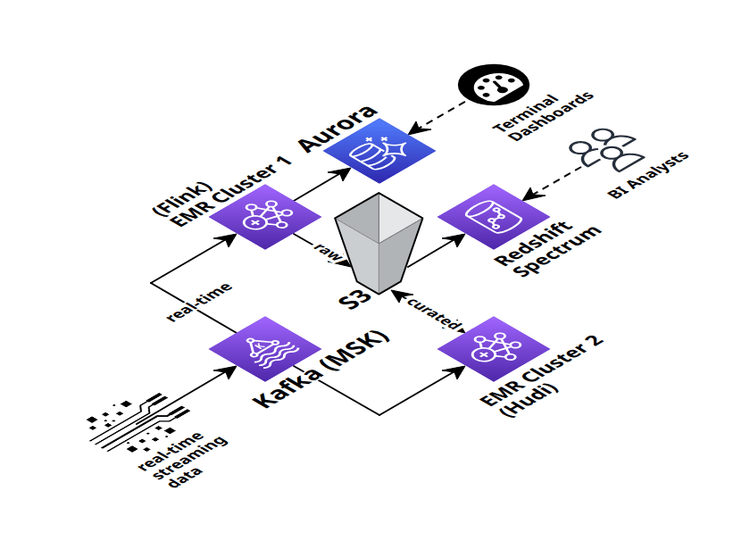

### Hi there.
---
Senior Data Engineer with 5+ years of experience. I architect, operate, modernize, and scale end-to-end data pipelines on AWS-native tooling for clients in manufacturing and financial services domains.

I worked on:
- Real-time ingestion (Kafka/Flink), lakehouse architectures (S3/Athena, Hudi, Redshift Spectrum), platform-level automation (Glue, Lambda, Lake Formation).
- Streaming pipelines processing 4,000+ factory feeds, and architected self-service analytical layers for thousands of daily queries. 
My work combines independent ownership with measurable revenue impacts: cost savings, latency reduction, and operational scaling.

Outside of work, I enjoy experimenting with popular open-source [data stacks](https://github.com/Creative-Ataraxia/CLV-data-pipeline) (currently Airbyte/Dagster/dbt/DuckDB/Docker) and LLM workflows. I recently placed in the top 3% of an LLM prompt engineering competition [Kaggle Silver Medalist](https://www.kaggle.com/certification/competitions/alexmason11/llms-you-cant-please-them-all).

Here are some of the architectures I've worked with:

  
  

I would be happy to explore any senior data engineering roles with your organization, please free feel to reach out to me here:
- [roy.ma9@gmail.com](mailto:roy.ma9@gmail.com)
- [Linkedin Profile](https://www.linkedin.com/in/royma/)
- I'm fully authorized to work in U.S., no visa sponsorships are needed now or in the future, I'm natively fluent in English, and I'm open to relocation to any parts of the U.S., E.U., or East Asia.
---
